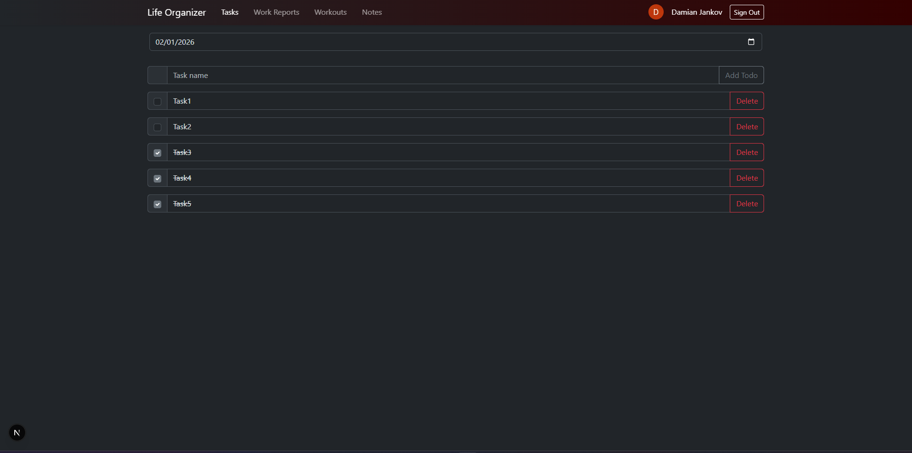
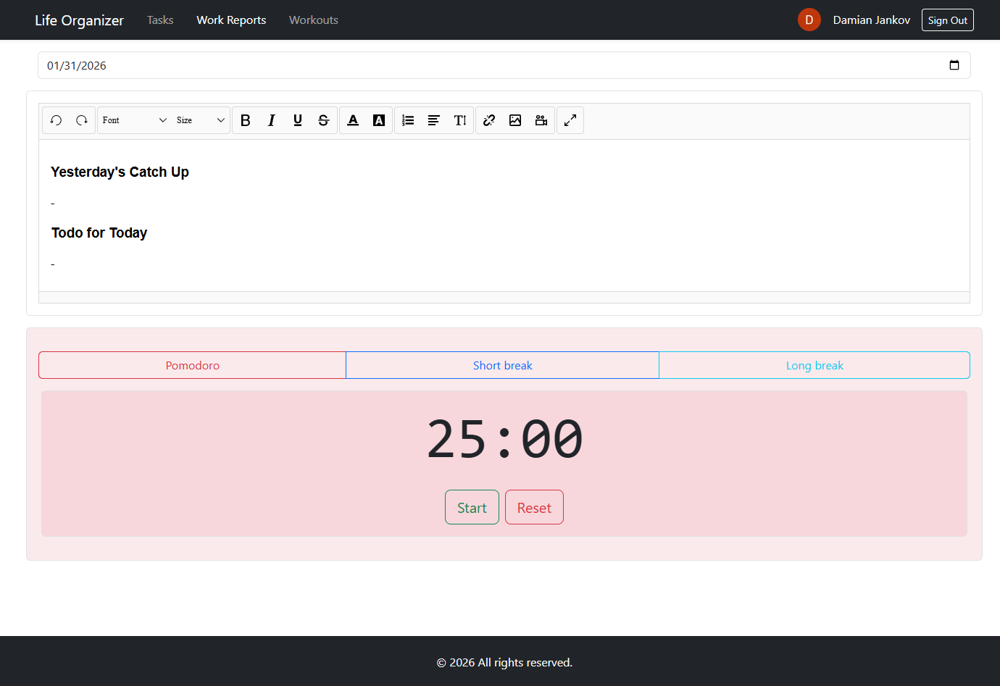
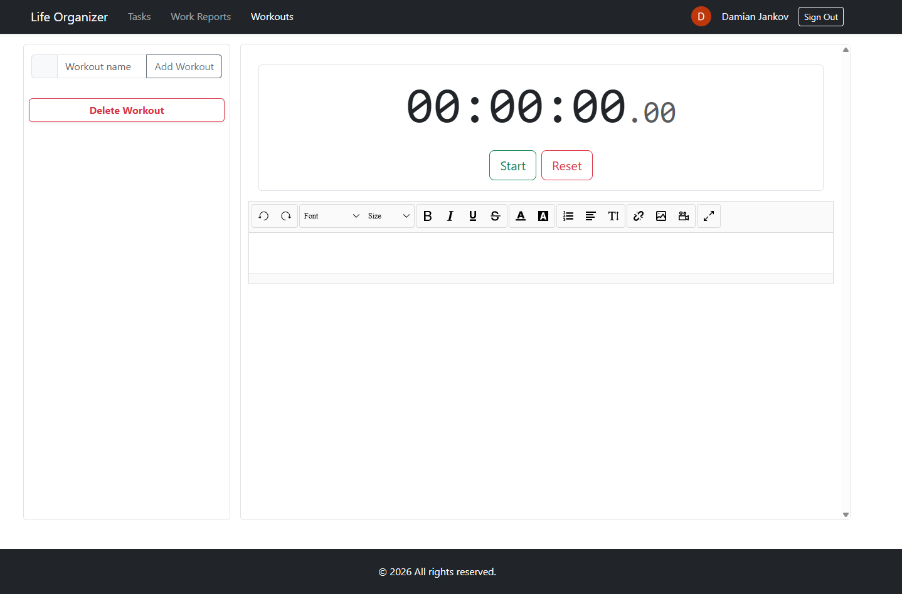
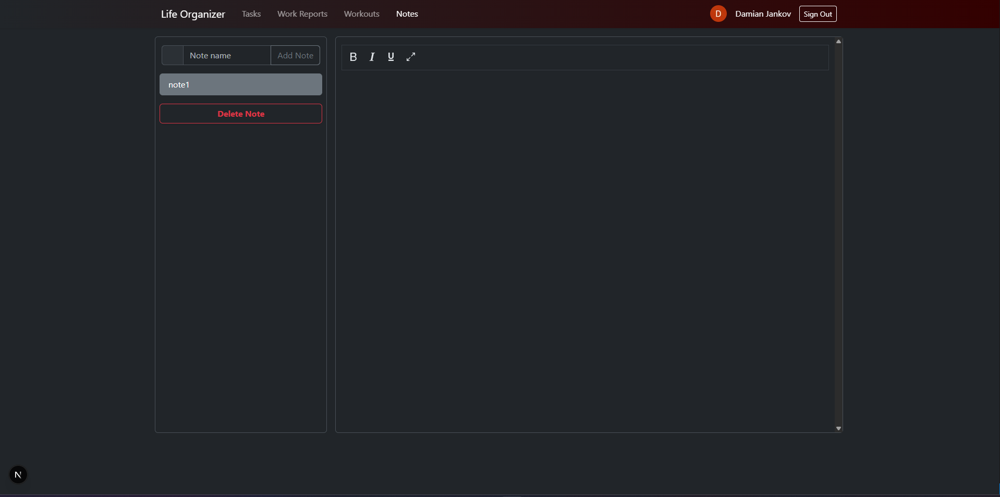

# Life Organizer

A personal productivity application built with Next.js 14, featuring task management, work reports, and workout tracking. The app uses Google OAuth for authentication and MongoDB for data persistence.

## Tech Stack

- **Framework**: Next.js 14 (App Router)
- **Authentication**: NextAuth.js with Google OAuth
- **Database**: MongoDB
- **UI**: React Bootstrap
- **Language**: TypeScript

### Pages

#### Home (`/`)
- Landing page showing welcome message for authenticated users
- Displays access denied message for unauthenticated users

#### Tasks (`/tasks`)

- Daily task management system
- Date-based task organization
- Create, update, and toggle task completion
- Tasks persist per date in MongoDB

#### Work Reports (`/workreports`)

- Daily work report editor
- Rich text editor with formatting options
- Date-based report management
- Integrated Pomodoro timer for time management
- Create and update reports for specific dates

#### Workouts (`/workouts`)

- Workout tracking and management
- Built-in stopwatch timer
- Rich text editor for workout details
- Add, edit, and delete workout entries
- View workout history

#### Notes (`/notes`)

- Note tracking and management
- Rich text editor for note details
- Add, edit, and delete note entries